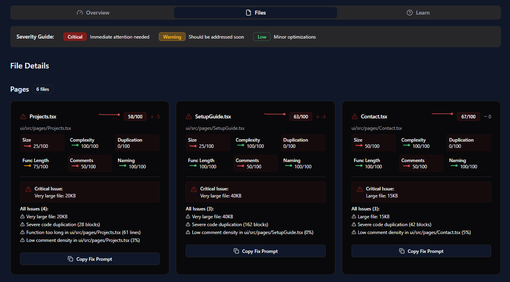

# Databutton Code Health Report - BETA

## Overview
A plug-and-play code health analysis tool for Databutton apps that helps you monitor, measure, and improve your codebase quality over time.

## Features
- 📊 **Complete Code Analysis**: Evaluates your entire codebase including Pages, UI Components, APIs, and UI Utilities.
- 📈 **Historical Tracking**: Records code health metrics over time to track improvements.
- 🔍 **Detailed Component Analysis**: Identifies specific issues in each file.
- 📱 **One Click Prompt Fix**: Quickly copy the task prompt to give to the agent for code fixes.
- 🛠️ **Actionable Recommendations**: Provides specific suggestions to improve code quality.
  

## Installation

### Task Instructions for Databutton Agent - TODO

### Manually Add Files
You can manually add these files to your own Databutton project. 

**Step 1: Add code to your Databutton Project**
1. Create a new page called `CodeHealth`, click on the ellipses on the new page and click **'Set read-only for agent'**.
2. Click **'Edit Code'** Copy the code from this file [CodeHealth.tsx](https://github.com/ElleNealAI/databutton-code-health-report/blob/main/ui/pages/CodeHealth.tsx) and replace the existing code.
3. Create a new API called `code_history`, click on the ellipses on the new API and click **'Set read-only for agent'**.
4. Copy the code from this file [code_history.py](https://github.com/ElleNealAI/databutton-code-health-report/blob/main/backend/code_history.py) and replace the existing code.

**Step 2: Run your report**
Navigate to the CodeHealth page and click **'Run New Analysis'**

This will trigger the API which will collect code health data about your Databutton application. A file will be created in Databutton storage called `code-health-history`

## Usage

### Running a Code Health Analysis
You can run the analysis as many times as you need, this will provide you with a current snapshot of your code health and provide insights to improve it.

1. Navigate to the **CodeHealth** page in your app.
2. Click the **'Run New Analysis'** button.

### Reading the Dashboard
- **Overall Score**: A composite health score out of 100.
- **Component Scores**: Breakdown by app section (Pages, Components, APIs, etc.).
- **Historical Trends**: Sparklines on each file showing health score changes over time.
- **Recommendations**: Actionable suggestions for improvement.

### Code Health Metrics

### Overview

### Files

### Learn

## Components

### Backend
- **Code History API**: Handles codebase scanning, analysis, and metric storage.

### Frontend
- **CodeHealth**: Main dashboard page displaying all metrics.

## Troubleshooting
- **API Errors**: Check that the `code_history` API is correctly installed.
- **Empty History**: Run an initial analysis to generate historical data.

## Contributing
Contributions are welcome! Please feel free to submit a Pull Request.

> **Note**: This tool analyzes your codebase structure and provides recommendations based on established best practices. Results should be interpreted as guidance rather than absolute rules.
